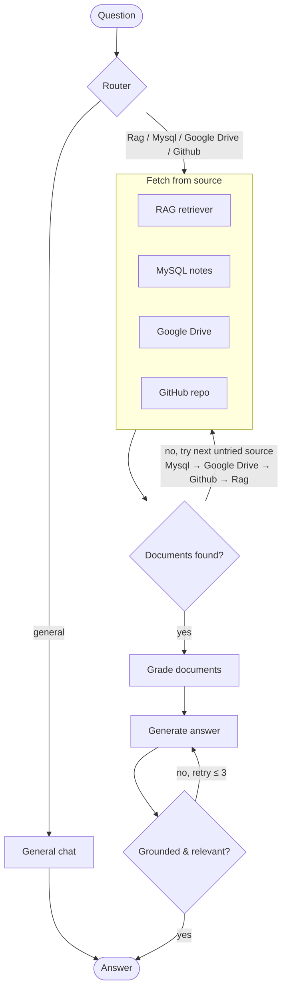

# Agentic RAG Nexus

A LangGraph agent that routes each question to whichever backend can actually
answer it — a local RAG knowledge base, a MySQL notes table, Google Drive
PDFs, or a GitHub repo — grades what comes back, and re-generates the answer
if it isn't grounded in the retrieved context.

## How it works



1. **Route** — an LLM classifies the question into `Rag`, `Mysql`,
   `Google Drive`, `Github`, or `General`.
2. **General** questions (greetings, small talk, general knowledge) skip
   retrieval entirely and go straight to the chat model.
3. **Fetch** — the chosen source is queried. If it comes back with no
   documents, `decide()` falls through to the next untried source in the
   order `Mysql → Google Drive → Github → Rag`, so a question routed to the
   wrong place still has a chance to find an answer.
4. **Grade** — each retrieved document is scored for relevance to the
   question; irrelevant ones are dropped.
5. **Generate** — an answer is produced from the surviving context.
6. **Check** — the answer is graded for hallucination (is it grounded in the
   context?) and relevance (does it answer the question?). If either check
   fails, generation is retried, up to 3 times.

## Stack

- [LangGraph](https://github.com/langchain-ai/langgraph) for the state machine above
- [Ollama](https://ollama.com) (`qwen3:1.7b` for chat, `nomic-embed-text` for embeddings) — run locally
- [Chroma](https://www.trychroma.com) as the vector store, persisted to `chroma_db/`
- MySQL + SQLAlchemy + Alembic for the notes source
- [FastMCP](https://github.com/jlowin/fastmcp) tool wrappers for the MySQL, GitHub, and Google Drive sources
- LangSmith Hub for the base RAG prompt (`rlm/rag-prompt`)

## Setup

```bash
uv sync
```

Create a `.env` in the project root:

```
GITHUB_TOKEN=your_github_personal_access_token
```

**Ollama**: install it and pull the models used by the graph:

```bash
ollama pull qwen3:1.7b
ollama pull nomic-embed-text
```

**MySQL**: a local server is expected at `localhost:3306`. Connection
details currently live in `app/database.py` — update them to match your
setup.

**Google Drive**: put an OAuth client secret file at `credentials.json`
(from the Google Cloud Console, Drive API enabled). The first Drive query
opens a browser to authorize and writes the resulting token to `token.json`.

## Run

```bash
uv run python main.py
```

Starts an interactive CLI chat loop; type `quit` to exit. A diagram of the
compiled graph is written to `graph.png` on exit.

To index the sample web pages into the RAG vector store:

```bash
uv run python -m graph.rag.ingestion
```

## Known limitations

- `app/database.py` has hardcoded MySQL credentials and connects at import
  time — move these to environment variables before deploying anywhere
  shared.
- `app/main.py` (a FastAPI entry point for the `notes` API) is not yet
  implemented.
- The GitHub/Google Drive/MySQL "MCP servers" are called as plain in-process
  Python functions rather than over MCP; the standalone
  `mcp.run(transport="http", ...)` entry points in `graph/mcp/*.py` aren't
  currently used by the graph.
