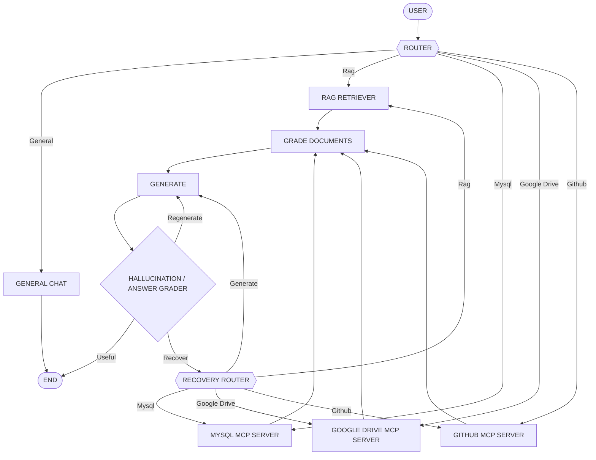

```
    ___   _____________   __________________   ____  ___   ______
   /   | / ____/ ____/ | / /_  __/  _/ ____/  / __ \/   | / ____/
  / /| |/ / __/ __/ /  |/ / / /  / // /      / /_/ / /| |/ / __
 / ___ / /_/ / /___/ /|  / / / _/ // /___   / _, _/ ___ / /_/ /
/_/  |_\____/_____/_/ |_/ /_/ /___/\____/  /_/ |_/_/  |_\____/

    _   _________  ____  _______
   / | / / ____/ |/ / / / / ___/
  /  |/ / __/  |   / / / /\__ \
 / /|  / /___ /   / /_/ /___/ /
/_/ |_/_____//_/|_\____//____/
```

<p align="center">
  <em>One question in. The right answer out — no matter which system it's hiding in.</em>
</p>

<p align="center">
  
  
  
  
</p>

---

A LangGraph agent that routes each question to whichever backend(s) can
actually answer it — a local RAG knowledge base, a MySQL notes table, Google
Drive PDFs, and/or a GitHub repo — grades what comes back, and re-generates
the answer if it isn't grounded in the retrieved context.

## How it works

The graph routes a question to one or more backends in parallel, grades and
merges what comes back, generates an answer, and grades that answer —
re-routing and retrying until it's grounded or a retry limit is hit.

Underneath `route` and `fetch`, the graph branches across four backends. A
question can be routed to several of them at once:




1. **Route** — an LLM classifies the question into one or more of `Rag`,
   `Mysql`, `Google Drive`, `Github`, `General`. Multiple datasources are
   chosen when the question needs combining or comparing information across
   sources (e.g. "compare my GitHub README with my Drive CV"), and each
   selected source is dispatched in parallel via LangGraph `Send`.
2. **General** questions (greetings, small talk, general knowledge) skip
   retrieval entirely, get answered straight from the chat model, and end
   immediately — no document grading or hallucination check.
3. **Fetch** — every selected source is queried; each source's documents are
   appended to the shared `documents` list in state.
4. **Grade docs** — each retrieved document is scored for relevance to the
   question; irrelevant ones are dropped and the survivors are joined into
   `context`.
5. **Generate** — an answer is produced from the context.
6. **Grade (check)** — the answer is graded for hallucination (is it
   grounded in the context?) and relevance (does it answer the question?):
   - not grounded → routed to a **recovery** node, which asks an LLM to pick
     one new datasource to re-fetch from (or to just retry generation as-is),
     then goes back through grading to `generate` again
   - grounded but not relevant → `generate` is retried directly
   - both pass → `useful`, done
   - after 3 attempts → `failed`, done regardless of grade

## Stack

- [LangGraph](https://github.com/langchain-ai/langgraph) for the state machine above
- [Ollama](https://ollama.com) (`qwen3:1.7b` for chat, `nomic-embed-text` for embeddings) — run locally
- [Chroma](https://www.trychroma.com) as the vector store, persisted to `chroma_db/`
- MySQL + SQLAlchemy + Alembic for the notes source
- [FastMCP](https://github.com/jlowin/fastmcp) tool wrappers for the MySQL, GitHub, and Google Drive sources
- LangSmith Hub for the base RAG prompt (`rlm/rag-prompt`)

## Setup

```bash
uv sync
```

Create a `.env` in the project root:

```
GITHUB_TOKEN=your_github_personal_access_token
```

### Ollama

Install it, then pull the models used by the graph:

```bash
ollama pull qwen3:1.7b
ollama pull nomic-embed-text
```

### MySQL

A local server is expected at `localhost:3306`. Connection details
currently live in `app/database.py` — update them to match your setup.

### Google Drive

Put an OAuth client secret file at `credentials.json` (from the Google
Cloud Console, Drive API enabled). The first Drive query opens a browser
to authorize and writes the resulting token to `token.json`.

## Run

```bash
uv run python main.py
```

> [!NOTE]
> As currently checked in, `main.py`'s interactive loop is commented out
> (`# asyncio.run(main())`), so this only prints the compiled graph's Mermaid
> source to stdout and exits — it does not chat or write a `graph.png`.
> Uncomment that line to get the interactive CLI loop (type `quit` to exit).

To index the sample web pages into the RAG vector store:

```bash
uv run python -m graph.rag.ingestion
```
